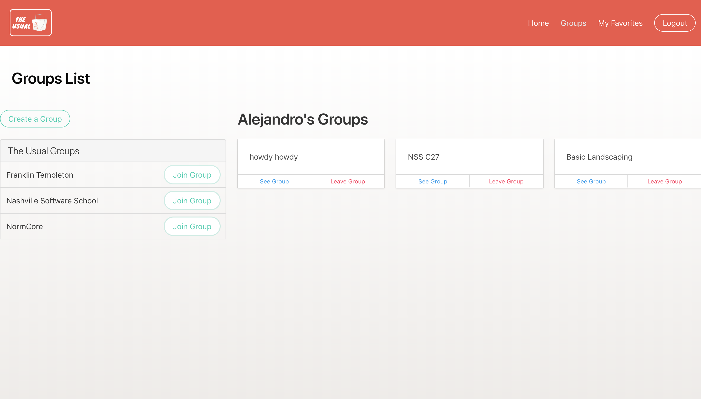

# The Usual

#### Front-End Capstone | Nashville Software School 



### Install Project

1. Clone the git repository 

```git clone https://github.com/alexfont321/theUsual.git```

2. In project's root directory install modules

```npm install```

3. Run project in root directory 

```npm start```

4. Run json server within the api directory

```
cd api 
json-server -p 5002 -w database.json
```

### Languages and Libraries 

* HTML
* CSS
* JavaScript
* React
* Bulma


### ERD 