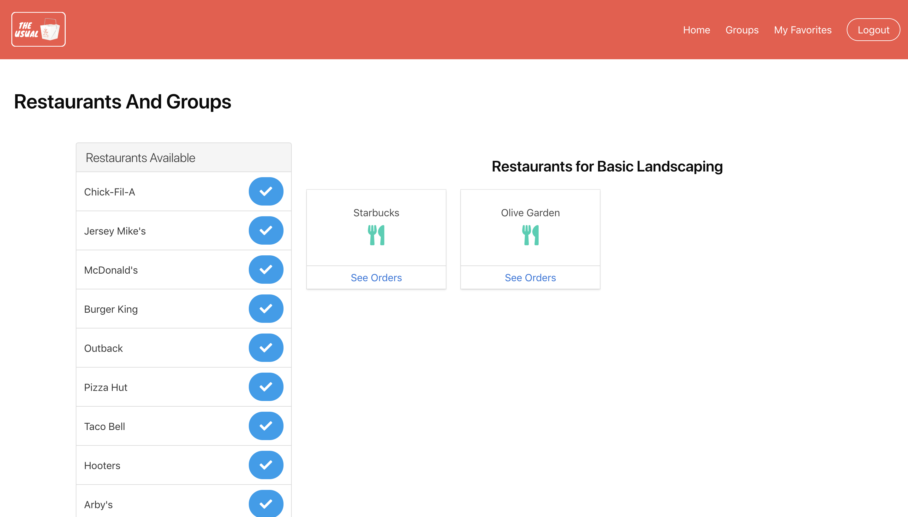
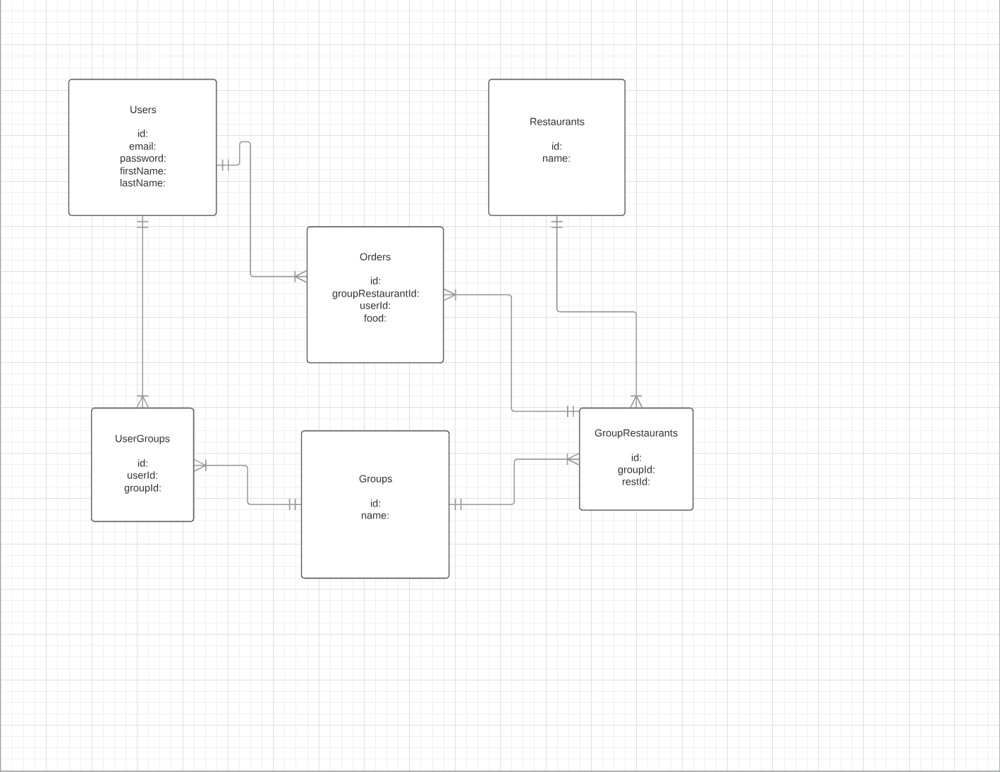

# The Usual

#### Front-End Capstone | Nashville Software School 


***



***

### Overview

> The creation of my app, The Usual, intends to assist large offices or groups with catered events. 

> Upon login, the user can create groups or join pre-existing groups. When the user enters the group, a list of restaurants that may be saved to the group are displayed on the left. Restuarants saved to the group will appear on the right side of the page. 

> The user then can enter the restaurant saved to the group and see previously saved orders. The user can add an order, edit a pre-existing order, or even delete an order. 

> The Usual gives users the oppertunity to view, all in one specific location, every group member's favorite order.   

***

### Install Project

1. Clone the git repository 

```
git clone https://github.com/alexfont321/theUsual.git
```

2. In project's root directory install modules

```
npm install
```

3. Run project in root directory 

```
npm start
```

4. Run json server within the api directory

```
cd api 
json-server -p 5002 -w database.json
```

***

### Languages and Libraries 

* HTML
* CSS
* JavaScript
* React
* Bulma

***

### ERD 

